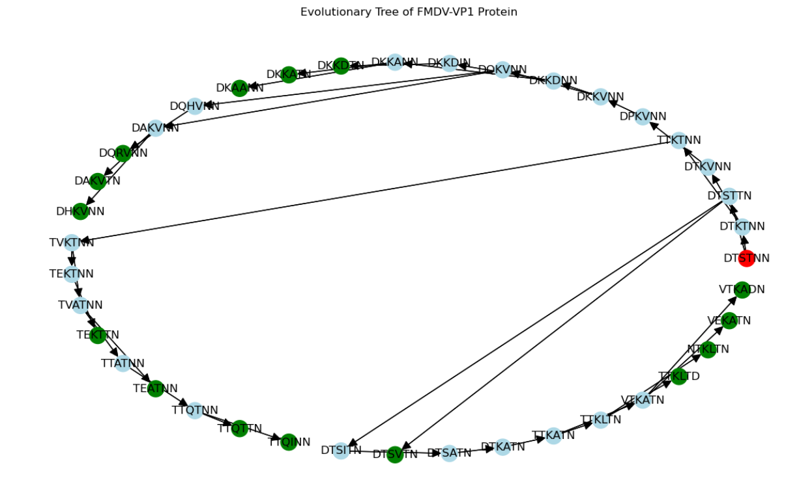
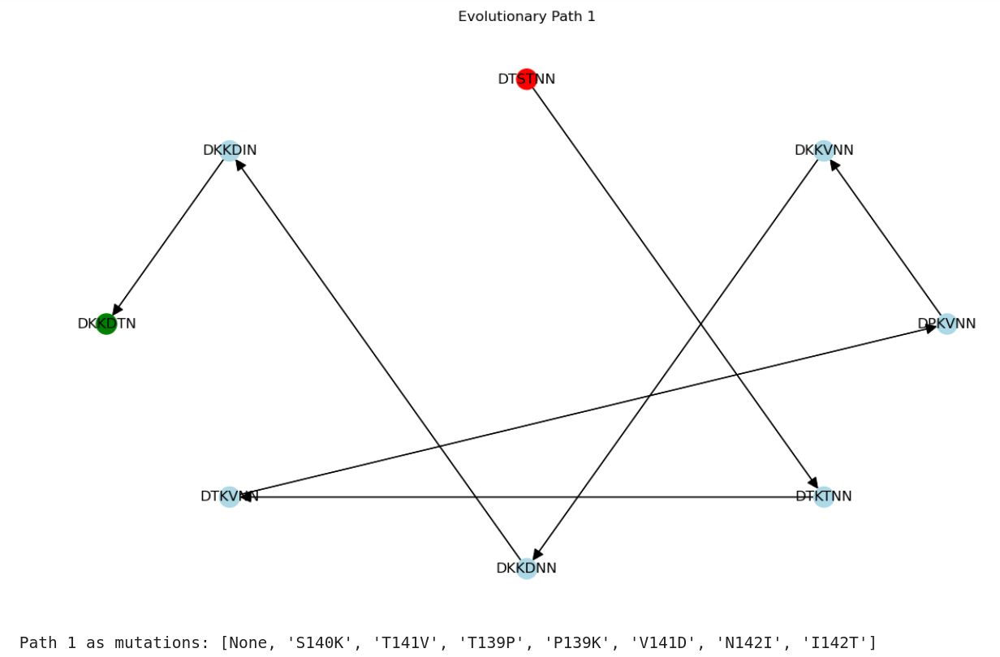
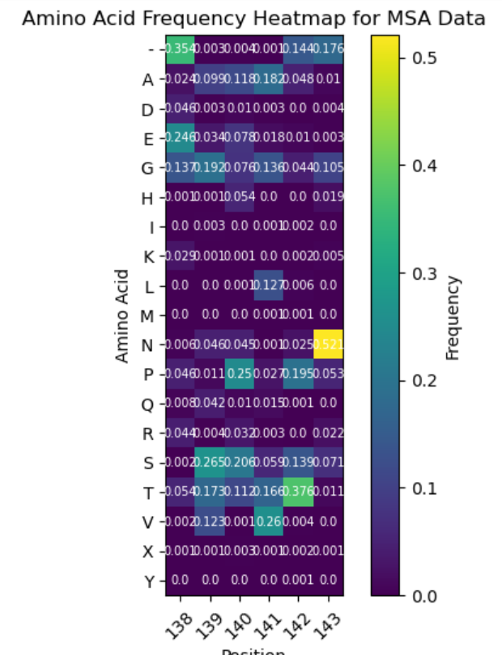
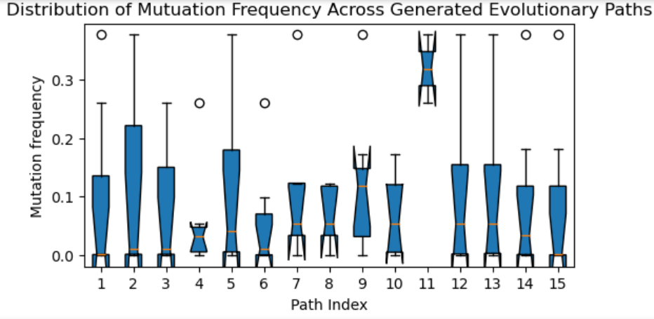
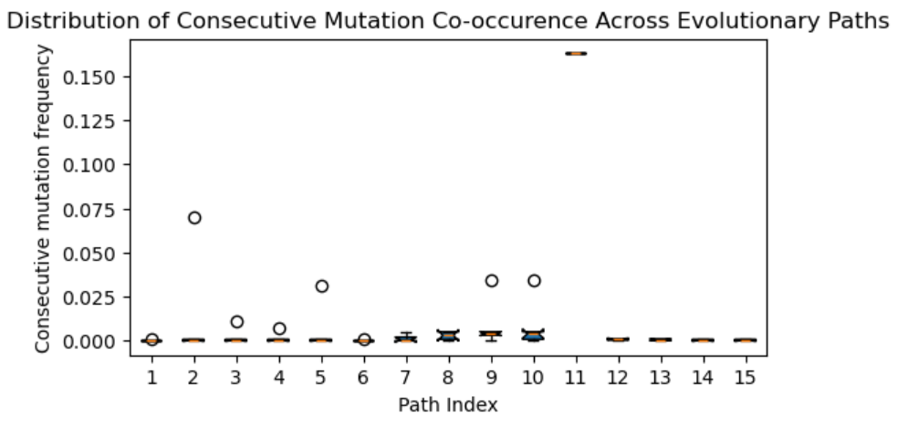

# Level 4 Single Honours Project
To carry out the evolution of the VP1 protein, a software package was created (fmd_evolution) which was used in a jupyter notebook (fmdv-evolution.ipynb). The evolution prediction system makes use of an open-source PLM from Facebook Research - ESM-2 - as well as well as the Numpy and PyTorch libraries for various components in the prediction system, the NetworkX library is used to build the evolutionary tree while Matplotlib was used to display it. Components and functionalities from this package were then used in a jupyter notebook to carry out the prediction on the given reference sequence, and to display the generated evolutionary tree. 

The evolutionary system has 4 main components: an Evolution class responsible for orchestrating evolution; a ProteinSequence class to represent data and metadata about a protein sequence; a MutationStrategy responsible for generating a pool of potential mutations; an EvaluationStrategy responsible for assigning probability and distance scores to mutations as well as filtering the pool for valid mutations.

### File Structure
/code  
|--- README.md  
|--- Manual.md  
|--- requirements.txt  
|--- fmdv-evolution-with-evaluation.ipynb  
|--- fmdv-evolution.ipynb  
|--- /fmd_evolution  
|---|--- __init__.py  
|---|--- model_singleton.py  
|---|--- protein_language_model.py  
|---|--- protein_sequence.py  
|---|--- mutation_strategy.py  
|---|--- evaluation_strategy.py  
|---|--- evolution.py  
|---|--- /evaluation  
|---|---|--- FMDV_VP1_HVR_1571seq_aln.fas  
|--- /images  
|---|--- (screenshot pngs)  

## Build instructions
### Requirements
- Python 3.12
- Packages
    - listed in `requirements.txt` 
    - fair-esm==2.0.0
    - pytorch==2.5.1
    - ipykernel==6.29.5
- Jupyter Notebook 
- Conda or any other tools for creating Python environments
- Tested on Windows 10 and Linux - Ubuntu 

### Build Steps
Option 1: Linux/Windows Environment Setup 
1. Create a python conda environment and activate it
    - conda create --name fmd_evolution_env python==3.12
    - conda activate fmd_evolution_env
2. Install required packages from the requirements.txt provided
    - conda install --file requirements.txt
3. Install remaining packages unavailable in default conda channels
    - pip install fair-esm==2.0.0
    - conda install pytorch -c pytorch
    - conda install -n fmd_evolution_env ipykernel
4. Add the conda env created as a Jupyter kernel
    - python -m ipykernel install --user --name fmd_evolution_env --display-name "Python fmd_evolution_env"

Option 2: Jupyter Notebook Setup (No Environment)
1. Run jupyter lab
    - jupyter-lab
2. Use default python kernel
3. Uncomment and run first cell in fmd_evolution.ipynb to directly install required packages

### Test steps
Using the fmd_evolution package in a jupyter notebook
1. (Optional) Activate the conda environment created
    - conda activate fmd_evolution_env
2. Run jupyter lab
    - jupyter-lab
3. (Optional) Select "Python fmd_evolution_env" as kernel
4. Open the notebook fmd_evolution.ipynb and restart the kernel and run all cells. This will run the following things:
    - "Setup Package, PLM and Reference Sequence"
        - Set up of the fmdv_evolution package, the protein language model and load the reference sequence.
    - "Evolve VP1 Reference Sequence Across 6 Highly Mutable Positions"
        - Set up objects for MutationStrategy, EvaluationStrategy and Evolution.
        - Evolve the reference sequence using the strategies defined.
        - Build the evolutionary tree containing mutation paths.
    - "Visualise Evolutionary Paths Generated for the VP1 Protein"
        - Display graph of evolutionary tree for the VP1 Protein.
        
        - Set up the evaluator object for Evaluation. 
        - Display each path as a graph, and each path as mutations. 
        

Due to the nature of the MSA data used, the MSA file used for evaluation of this system cannot be distributed and published beyond the research group it belongs to. Therefore, I have included a separate notebook called fmdv-evolution-with-evaluation.ipynb which includes the cells that generated the graphs for the Evaluation section of the dissertation. Note that because the MSA file specified in the notebook is not present in the code submission, this notebook cannot be ran and can simply be statically inspected. 

- "Evaluation of Predicted Evolutionary Paths Against MSA"
        - Display heatmap of amino acid frequency per position for the MSA.
        
        - Display box plot of Mutation Frequency (MF) values across all generated paths.
        
        - Display box plot of Consecutive Mutation (CMC) Co-occurrence values across all generated paths.
        
        - Compute and print summary metrics for set of generated paths from MF and CMC values. 

If you would like to see all relevant classes and methods in the package, change any of the parameter values in the notebook or change the seed set for the package, please see the Manual.md.